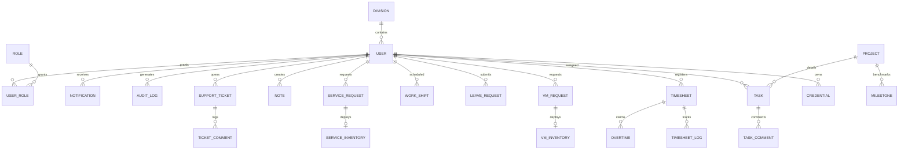

# YATO System Database Documentation

Platform YATO menggunakan database relational **PostgreSQL** yang diatur secara deklaratif melalui ORM **Prisma**. Dokumentasi ini merinci total **40 tabel** database yang dikelompokkan ke dalam beberapa subsistem logis, struktur relasi, serta fungsinya masing-masing.

---

## 🗺️ High-Level ERD (Entity Relationship Diagram)

---

## 🗄️ Rincian Modul & Daftar Tabel

### Modul 1: Autentikasi, Keamanan, & Sistem Kontrol (10 Tabel)
Mengatur pendaftaran pengguna, sesi login, hak akses RBAC (Role-Based Access Control), token API pihak ketiga, validasi MFA (Multi-Factor Authentication), kode OTP, dan log audit sistem.

#### 1. `User`
- **Tujuan**: Tabel utama data akun pengguna, konfigurasi kontak (email, nomor WhatsApp, Telegram ID) untuk broadcast, preferensi notifikasi, enkripsi password, dan status MFA.
- **Relasi**:
  - `Many-to-Many` ke tabel `Role` melalui `UserRole`.
  - `One-to-Many` ke tabel `Timesheet`, `Task`, `VMRequest`, `Credential`, dll.
  - `Many-to-One` ke tabel `Division`.

#### 2. `Role`
- **Tujuan**: Menyimpan definisi peran pengguna (misal: ADMIN, SYSTEM ADMIN, HR, USER).
- **Kolom Utama**: `name` (unique), `permissions` (array string hak akses).
- **Relasi**: `Many-to-Many` ke `User` via `UserRole`.

#### 3. `UserRole`
- **Tujuan**: Tabel pivot penyambung Many-to-Many antara tabel `User` dan `Role`.
- **Relasi**: `userId` -> `User.id`, `roleId` -> `Role.id`.

#### 4. `ApiToken`
- **Tujuan**: Token API eksternal yang dibuat oleh user untuk keperluan integrasi otomatisasi pihak ketiga secara aman.
- **Relasi**: `userId` -> `User.id` (One-to-Many).

#### 5. `LoginHistory`
- **Tujuan**: Mencatat setiap aktivitas login sukses pengguna demi kebutuhan audit keamanan.
- **Kolom Utama**: `ipAddress`, `userAgent`, `timestamp`.
- **Relasi**: `userId` -> `User.id`.

#### 6. `AuditLog`
- **Tujuan**: Pencatatan log forensik aktivitas mutasi data penting (Insert/Update/Delete) di sistem YATO.
- **Kolom Utama**: `action` (misal: `CREATE_VM`), `resource`, `resourceId`, `metadata` (JSON detail perubahan), `ipAddress`, `userAgent`.
- **Relasi**: `userId` -> `User.id`.

#### 7. `Notification`
- **Tujuan**: Menyimpan pesan notifikasi internal user dan riwayat broadcast multi-channel.
- **Kolom Utama**: `title`, `message`, `type` (INFO, SUCCESS, WARNING, ERROR), `link`, `isRead`.
- **Relasi**: `userId` -> `User.id`.

#### 8. `Otp`
- **Tujuan**: Menyimpan kode verifikasi sementara (OTP) untuk proses registrasi dan reset password.
- **Kolom Utama**: `email`, `phone`, `telegram`, `code`, `type` (REGISTER, FORGOT_PASSWORD), `expiresAt`.

#### 9. `SystemSetting`
- **Tujuan**: Tabel penyimpanan konfigurasi sistem global yang bersifat dinamis (key-value).
- **Kolom Utama**: `key` (String ID), `value` (JSON payload konfigurasi).

#### 10. `Integration`
- **Tujuan**: Menyimpan kredensial dan endpoint konektor pihak ketiga (Proxmox VE, Grafana, Evolution API, Telegram Bot).
- **Kolom Utama**: `name`, `type`, `connectorKey`, `endpointUrl`, `config` (terenkripsi AES-256).

---

### Modul 2: HRM, Absensi, & Manajemen Kerja (11 Tabel)
Mengatur pengelolaan divisi, shift kerja mingguan/bulanan karyawan, sistem kehadiran presisi tinggi dengan geo-fencing/selfie, klaim lembur, serta manajemen cuti berjenjang.

#### 11. `Division`
- **Tujuan**: Menyimpan data divisi perusahaan (IT, NOC, Finance, dll).
- **Kolom Utama**: `supervisorId`, `managerId`, `headId` (menentukan alur approver cuti otomatis).
- **Relasi**: Berelasi ke `User` (staf & jajaran pimpinan).

#### 12. `ShiftCategory`
- **Tujuan**: Template jadwal shift kerja standar (jam mulai, selesai, istirahat, dan kode warna UI).
- **Kolom Utama**: `startTime`, `endTime`, `allowanceAmt` (insentif shift malam/luar kota).

#### 13. `WorkShift`
- **Tujuan**: Jadwal shift kerja harian yang ditugaskan kepada masing-masing staf (*roster grid*).
- **Relasi**: `userId` -> `User.id`, `shiftCategoryId` -> `ShiftCategory.id`.

#### 14. `ShiftSwapRequest`
- **Tujuan**: Pencatatan permohonan tukar shift kerja antar sesama staf.
- **Kolom Utama**: `status` (PENDING, TARGET_ACCEPTED, APPROVED, REJECTED).
- **Relasi**: Menghubungkan pengaju (`requesterId`), target pertukaran (`targetUserId`), dan shift terkait.

#### 15. `Timesheet`
- **Tujuan**: Rekapitulasi status kehadiran karyawan per hari kerja (PRESENT, LATE, ABSENT, ON_LEAVE).
- **Kolom Utama**: `status`, `totalHours`, `notes` (daily report), `latenessReason` (alasan terlambat).
- **Relasi**: `userId` -> `User.id`.

#### 16. `TimesheetLog`
- **Tujuan**: Riwayat presisi ketukan tombol kehadiran Check-In & Check-Out (mencatat IP address, koordinat lokasi, info device, dan link selfie).
- **Relasi**: `timesheetId` -> `Timesheet.id` (Cascade onDelete).

#### 17. `AttendanceAdjustmentLog`
- **Tujuan**: Catatan koreksi/penyesuaian data absensi staf yang dilakukan secara manual oleh administrator/HR.
- **Relasi**: `timesheetId` -> `Timesheet.id`, `adminId` -> `User.id` (Admin).

#### 18. `Overtime`
- **Tujuan**: Pencatatan pengajuan jam lembur staf (klaim durasi, deskripsi pekerjaan, status approval).
- **Relasi**: `timesheetId` -> `Timesheet.id`.

#### 19. `LeaveRequest`
- **Tujuan**: Formulir pengajuan izin cuti karyawan beserta lampiran surat pendukung.
- **Kolom Utama**: `type` (ANNUAL, SICK, PERMIT), `startDate`, `endDate`, `reason`, `status`.
- **Relasi**: `userId` -> `User.id`.

#### 20. `LeaveApproval`
- **Tujuan**: Record persetujuan cuti bertingkat/multi-level (Level 1: Supervisor, Level 2: Manager, Level 3: Head).
- **Relasi**: `leaveRequestId` -> `LeaveRequest.id`.

#### 21. `LeaveBalance`
- **Tujuan**: Kuota cuti tahunan karyawan yang terus diperbarui otomatis setiap kali cuti disetujui.
- **Kolom Utama**: `allocated` (jatah tahunan), `used` (terpakai), `remaining` (sisa kuota).

---

### Modul 3: Manajemen Infrastruktur & Aset Virtual/Fisik (9 Tabel)
Digunakan untuk mencatat daftar server fisik (bare metal), provision VM otomatis melalui Proxmox, data asset, pergerakan hardware, dependensi infrastruktur, dan kredensial terenkripsi.

#### 22. `VMRequest`
- **Tujuan**: Formulir permintaan pembuatan mesin virtual (VM) baru oleh pengguna umum yang membutuhkan persetujuan admin.
- **Kolom Utama**: `cpu`, `ram`, `disk`, `osTemplate`, `environment`, `status` (PENDING, APPROVED, FAILED, dll).

#### 23. `VMInventory`
- **Tujuan**: Inventarisasi detail VM yang berhasil di-deploy (IP address, password SSH, port, reference credential).
- **Relasi**: `requestId` -> `VMRequest.id` (One-to-One).

#### 24. `ServiceRequest`
- **Tujuan**: Pengajuan kebutuhan deployment microservice / database stack.
- **Kolom Utama**: `serviceName`, `version`, `environment`, `config` (JSON).

#### 25. `ServiceInventory`
- **Tujuan**: Detail informasi akses microservice yang berhasil ter-deploy.
- **Relasi**: `requestId` -> `ServiceRequest.id` (One-to-One).

#### 26. `Credential`
- **Tujuan**: Brankas (vault) kredensial server terenkripsi AES-256 (username, password, SSH key) yang dikaitkan ke user tertentu.
- **Relasi**: `userId` -> `User.id`.

#### 27. `Asset`
- **Tujuan**: Inventarisasi hardware internal perusahaan (Server, Laptop, Switch) lengkap dengan QR Code, status fisik, dan monitoring performa hardware (CPU/Memory usage).
- **Relasi**: `ownerId` -> `User.id`.

#### 28. `AssetMovement`
- **Tujuan**: Log mutasi lokasi fisik hardware (misal: pindah rack datacenter atau perpindahan tangan peminjaman aset laptop).
- **Relasi**: `assetId` -> `Asset.id` (Cascade onDelete).

#### 29. `AssetRelationship`
- **Tujuan**: Hubungan topologi jaringan (misal: VM A berjalan di dalam Hypervisor Server B).
- **Relasi**: Menghubungkan source `Asset` dan target `Asset` melalui kode relasi unik.

#### 30. `Catalog`
- **Tujuan**: Master list data statis sistem (contoh: daftar OS templates Proxmox, kategori VM, dll).

---

### Modul 4: Produktivitas, Proyek & Kalender (7 Tabel)
Subsistem Kanban dan Gantt Chart untuk tim kerja, milestone proyek, personal notes, dan event di kalender PMO.

#### 31. `Project`
- **Tujuan**: Manajemen proyek penampung tasks, penentuan target lini masa proyek.
- **Kolom Utama**: `name`, `startDate`, `endDate`, `status` (PLANNING, ACTIVE, COMPLETED, ON_HOLD).

#### 32. `Milestone`
- **Tujuan**: Penanda/target penting dalam sebuah siklus pengerjaan proyek.
- **Relasi**: `projectId` -> `Project.id` (Cascade onDelete).

#### 33. `Task`
- **Tujuan**: Kumpulan tugas kerja spesifik (Kanban card) dengan tenggat waktu, checklist internal subtask, level prioritas, dan tim pelaksana (assignees).
- **Relasi**: `projectId` -> `Project.id`, `createdById` -> `User.id`.

#### 34. `TaskTemplate`
- **Tujuan**: Pola tugas berkala untuk otomasi pembuatan tugas berulang (contoh: "Backup Database Harian NOC").
- **Kolom Utama**: `repeatInterval` (DAILY, WEEKLY, MONTHLY), `repeatTime`.

#### 35. `TaskComment`
- **Tujuan**: Diskusi kolaboratif di dalam card tugas (mendukung reply bertingkat/threaded comments).
- **Relasi**: `taskId` -> `Task.id`.

#### 36. `Note`
- **Tujuan**: Catatan pribadi cepat (sticky notes) dengan opsi pinned, arsip, reminder, dan warna.
- **Relasi**: `userId` -> `User.id`.

#### 37. `CalendarNote`
- **Tujuan**: Catatan agenda harian / blockers pada kalender PMO.
- **Relasi**: `userId` -> `User.id`.

---

### Modul 5: Helpdesk & File Storage (3 Tabel)
Menangani tiket pengaduan serta manajemen berkas unggahan terpusat.

#### 38. `SupportTicket`
- **Tujuan**: Tiket kendala bantuan umum (helpdesk) yang dilaporkan pengguna kepada tim IT Support/Admin.
- **Kolom Utama**: `subject`, `description`, `priority` (NORMAL, HIGH, URGENT), `status` (OPEN, CLOSED).

#### 39. `TicketComment`
- **Tujuan**: Percakapan penyelesaian kendala di dalam tiket (Support Ticket, VM Request, atau Service Request).
- **Relasi**: Menghubungkan ke tabel tiket terkait dan user author.

#### 40. `StorageFile`
- **Tujuan**: Indeks penyimpanan file unggahan global (lampiran pdf cuti, capture foto selfie absensi, attachment tiket).
- **Kolom Utama**: `filename`, `mimeType`, `size`, `driver` (DATABASE, S3, GDrive, NAS), `path` (lokasi fisik berkas).
- **Relasi**: `uploadedById` -> `User.id`.
