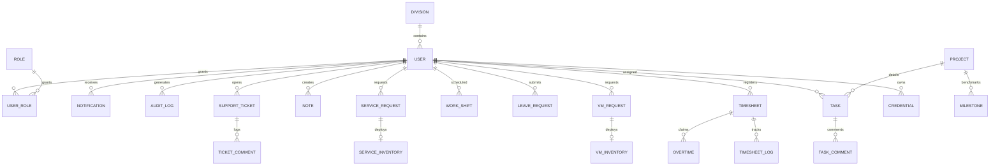

# YATO Database Documentation

Platform YATO menggunakan database relational **PostgreSQL** yang diatur secara deklaratif melalui ORM **Prisma**. Dokumentasi ini merinci total **40 tabel** database yang dikelompokkan ke dalam beberapa subsistem logis, struktur relasi, serta fungsinya masing-masing.

---

## High-Level ERD

---

## Module 1: Authentication, Security & System Control (10 Tables)

Mengatur pendaftaran pengguna, sesi login, hak akses RBAC, token API, validasi MFA, kode OTP, dan log audit sistem.

### 1. User
- **Tujuan**: Tabel utama data akun pengguna, konfigurasi kontak (email, WhatsApp, Telegram), preferensi notifikasi, enkripsi password, dan status MFA.
- **Relasi**:
  - `Many-to-Many` ke `Role` melalui `UserRole`
  - `One-to-Many` ke `Timesheet`, `Task`, `VMRequest`, `Credential`, dll
  - `Many-to-One` ke `Division`

### 2. Role
- **Tujuan**: Definisi peran pengguna (ADMIN, SYSTEM ADMIN, HR, USER)
- **Kolom Utama**: `name` (unique), `permissions` (array string)
- **Relasi**: `Many-to-Many` ke `User` via `UserRole`

### 3. UserRole
- **Tujuan**: Tabel pivot Many-to-Many antara `User` dan `Role`
- **Relasi**: `userId` -> `User.id`, `roleId` -> `Role.id`

### 4. ApiToken
- **Tujuan**: Token API eksternal untuk integrasi otomatisasi pihak ketiga
- **Relasi**: `userId` -> `User.id` (One-to-Many)

### 5. LoginHistory
- **Tujuan**: Catatan setiap aktivitas login untuk audit keamanan
- **Kolom Utama**: `ipAddress`, `userAgent`, `timestamp`
- **Relasi**: `userId` -> `User.id`

### 6. AuditLog
- **Tujuan**: Log forensik aktivitas mutasi data (Insert/Update/Delete)
- **Kolom Utama**: `action`, `resource`, `resourceId`, `metadata` (JSON), `ipAddress`, `userAgent`
- **Relasi**: `userId` -> `User.id`

### 7. Notification
- **Tujuan**: Pesan notifikasi internal dan riwayat broadcast multi-channel
- **Kolom Utama**: `title`, `message`, `type` (INFO, SUCCESS, WARNING, ERROR), `link`, `isRead`
- **Relasi**: `userId` -> `User.id`

### 8. Otp
- **Tujuan**: Kode verifikasi sementara untuk registrasi dan reset password
- **Kolom Utama**: `email`, `phone`, `telegram`, `code`, `type` (REGISTER, FORGOT_PASSWORD), `expiresAt`

### 9. SystemSetting
- **Tujuan**: Konfigurasi sistem global dinamis (key-value)
- **Kolom Utama**: `key` (String ID), `value` (JSON payload)

### 10. Integration
- **Tujuan**: Kredensial dan endpoint konektor pihak ketiga (Proxmox VE, Grafana, Telegram Bot)
- **Kolom Utama**: `name`, `type`, `connectorKey`, `endpointUrl`, `config` (terenkripsi AES-256)

---

## Module 2: HRM, Attendance & Work Management (11 Tables)

Mengatur divisi, shift kerja, kehadiran, klaim lembur, dan manajemen cuti berjenjang.

### 11. Division
- **Tujuan**: Data divisi perusahaan (IT, NOC, Finance, dll)
- **Kolom Utama**: `supervisorId`, `managerId`, `headId` (alur approver cuti)
- **Relasi**: Berelasi ke `User`

### 12. ShiftCategory
- **Tujuan**: Template jadwal shift standar (jam mulai, selesai, istirahat)
- **Kolom Utama**: `startTime`, `endTime`, `allowanceAmt`

### 13. WorkShift
- **Tujuan**: Jadwal shift harian yang ditugaskan ke staf (roster)
- **Relasi**: `userId` -> `User.id`, `shiftCategoryId` -> `ShiftCategory.id`

### 14. ShiftSwapRequest
- **Tujuan**: Permohonan tukar shift antar staf
- **Kolom Utama**: `status` (PENDING, TARGET_ACCEPTED, APPROVED, REJECTED)
- **Relasi**: `requesterId`, `targetUserId`

### 15. Timesheet
- **Tujuan**: Rekapitulasi kehadiran per hari (PRESENT, LATE, ABSENT, ON_LEAVE)
- **Kolom Utama**: `status`, `totalHours`, `notes`, `latenessReason`
- **Relasi**: `userId` -> `User.id`

### 16. TimesheetLog
- **Tujuan**: Riwayat Check-In & Check-Out (IP, koordinat, device, selfie)
- **Relasi**: `timesheetId` -> `Timesheet.id` (Cascade)

### 17. AttendanceAdjustmentLog
- **Tujuan**: Koreksi data absensi oleh admin/HR
- **Relasi**: `timesheetId` -> `Timesheet.id`, `adminId` -> `User.id`

### 18. Overtime
- **Tujuan**: Pengajuan jam lembur
- **Relasi**: `timesheetId` -> `Timesheet.id`

### 19. LeaveRequest
- **Tujuan**: Formulir pengajuan cuti dengan lampiran
- **Kolom Utama**: `type` (ANNUAL, SICK, PERMIT), `startDate`, `endDate`, `reason`, `status`
- **Relasi**: `userId` -> `User.id`

### 20. LeaveApproval
- **Tujuan**: Persetujuan cuti multi-level (Supervisor, Manager, Head)
- **Relasi**: `leaveRequestId` -> `LeaveRequest.id`

### 21. LeaveBalance
- **Tujuan**: Kuota cuti tahunan yang diperbarui otomatis
- **Kolom Utama**: `allocated`, `used`, `remaining`

---

## Module 3: Infrastructure & Virtual/Physical Assets (9 Tables)

Mencatat server fisik, provision VM, data asset, pergerakan hardware, dan kredensial terenkripsi.

### 22. VMRequest
- **Tujuan**: Permintaan pembuatan VM baru (perlu persetujuan admin)
- **Kolom Utama**: `cpu`, `ram`, `disk`, `osTemplate`, `environment`, `status`

### 23. VMInventory
- **Tujuan**: Inventaris VM yang berhasil di-deploy
- **Relasi**: `requestId` -> `VMRequest.id` (One-to-One)

### 24. ServiceRequest
- **Tujuan**: Pengajuan deployment microservice / database
- **Kolom Utama**: `serviceName`, `version`, `environment`, `config` (JSON)

### 25. ServiceInventory
- **Tujuan**: Detail akses service yang ter-deploy
- **Relasi**: `requestId` -> `ServiceRequest.id` (One-to-One)

### 26. Credential
- **Tujuan**: Vault kredensial terenkripsi AES-256 (username, password, SSH key)
- **Relasi**: `userId` -> `User.id`

### 27. Asset
- **Tujuan**: Inventaris hardware (Server, Laptop, Switch) dengan QR Code
- **Relasi**: `ownerId` -> `User.id`

### 28. AssetMovement
- **Tujuan**: Log mutasi lokasi hardware
- **Relasi**: `assetId` -> `Asset.id` (Cascade)

### 29. AssetRelationship
- **Tujuan**: Hubungan topologi jaringan (VM -> Hypervisor, Server -> Rack)
- **Relasi**: Menghubungkan source `Asset` dan target `Asset`

### 30. Catalog
- **Tujuan**: Master list data statis (OS templates, kategori VM, dll)

---

## Module 4: Productivity, Projects & Calendar (7 Tables)

Kanban task, milestone proyek, personal notes, dan event kalender PMO.

### 31. Project
- **Tujuan**: Manajemen proyek dan timeline
- **Kolom Utama**: `name`, `startDate`, `endDate`, `status` (PLANNING, ACTIVE, COMPLETED, ON_HOLD)

### 32. Milestone
- **Tujuan**: Target penting dalam siklus proyek
- **Relasi**: `projectId` -> `Project.id` (Cascade)

### 33. Task
- **Tujuan**: Tugas kerja (Kanban card) dengan deadline, checklist, dan assignees
- **Relasi**: `projectId` -> `Project.id`, `createdById` -> `User.id`

### 34. TaskTemplate
- **Tujuan**: Pola tugas berulang untuk otomasi
- **Kolom Utama**: `repeatInterval` (DAILY, WEEKLY, MONTHLY), `repeatTime`

### 35. TaskComment
- **Tujuan**: Diskusi di dalam task (threaded comments)
- **Relasi**: `taskId` -> `Task.id`

### 36. Note
- **Tujuan**: Catatan pribadi (sticky notes) dengan pinned, arsip, reminder
- **Relasi**: `userId` -> `User.id`

### 37. CalendarNote
- **Tujuan**: Catatan agenda harian pada kalender PMO
- **Relasi**: `userId` -> `User.id`

---

## Module 5: Helpdesk & File Storage (3 Tables)

Tiket pengaduan dan manajemen berkas unggahan.

### 38. SupportTicket
- **Tujuan**: Tiket kendala bantuan untuk tim IT Support
- **Kolom Utama**: `subject`, `description`, `priority` (NORMAL, HIGH, URGENT), `status` (OPEN, CLOSED)

### 39. TicketComment
- **Tujuan**: Percakapan penyelesaian kendala di dalam tiket
- **Relasi**: Menghubungkan tiket terkait dan user author

### 40. StorageFile
- **Tujuan**: Indeks file unggahan global (lampiran cuti, foto selfie, attachment)
- **Kolom Utama**: `filename`, `mimeType`, `size`, `driver` (DATABASE, S3, GDrive, NAS), `path`
- **Relasi**: `uploadedById` -> `User.id`
