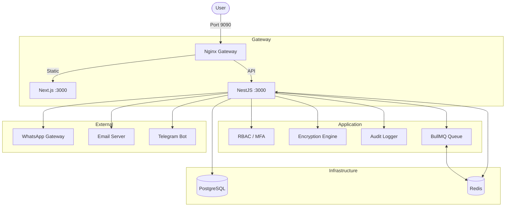

# YATO Platform
### Unified Infrastructure Operations & Asset Management Platform

<p align="center">
  
  
  
  
  
  
  
</p>

---

## Overview

**YATO** is a unified IT Operations, Task Management, and Asset Registry platform built to streamline communications between development teams, helpdesk support, and system administrators.

The name **YATO** is inspired by **Yato (夜ト)**, the stray god from the anime series ***Noragami***. True to its namesake, YATO acts as the dedicated "helper god" for IT Support, Project Management, and Infrastructure Operations.

---

## Core Features

### 1. Helpdesk Ticketing
- Classify support tickets by category (`GENERAL`, `INFRASTRUCTURE`, `BILLING`, etc.)
- Threaded comment collaboration with file uploads
- Multi-channel notifications: Email, WhatsApp, Telegram

### 2. Task & Project Management
- Kanban task tracking with priorities and checklists
- Task templates for recurring automation
- Comment threads with file attachments

### 3. Encrypted Credential Vault
- AES-256-GCM envelope encryption (DEK/KEK architecture)
- On-the-fly key rotation with zero downtime
- Immutable audit logging for every credential access

### 4. Asset Registry & CMDB
- Physical and digital asset inventory with QR codes
- Datacenter rack mapping with unit positions
- Asset dependency graph for infrastructure topology

### 5. Identity & Access Control
- MFA/2FA with TOTP (Google Authenticator, Authy)
- Role-Based Access Control (RBAC) with granular permissions
- Brute-force protection with automatic account lockout

### 6. Production Hardening
- Docker socket proxy isolation (zero direct Docker access)
- Non-root containers, private network isolation
- Dual-layer rate limiting (Nginx + Application)

---

## Technology Stack

| Tier | Component | Technology | Purpose |
|------|-----------|------------|---------|
| Frontend | Framework | Next.js 14 (App Router) | React portal with SSR |
| | Styling | Tailwind CSS | Responsive UI |
| | State | React Query (TanStack) | Server state management |
| Backend | Framework | NestJS + TypeScript | Modular REST API |
| | ORM | Prisma | Type-safe database queries |
| | Queue | BullMQ | Background job processing |
| | Sockets | Socket.IO | Real-time WebSocket |
| Database | Primary | PostgreSQL 15 | Relational storage |
| | Cache | Redis 7 | Cache + queue backend |
| Proxy | Web Server | Nginx | Reverse proxy + SSL |

---

## Architecture



---

## System Requirements

### Minimum (Development)
- CPU: 2 vCPUs
- RAM: 4 GB (8 GB recommended for Docker)
- Disk: 20 GB SSD
- OS: Ubuntu 20.04+, Debian 11+, Rocky Linux 8+, macOS, Windows WSL2
- Docker: v24.0+ with Compose v2.20+

### Recommended (Production)
- CPU: 4+ vCPUs
- RAM: 8-16 GB
- Disk: 50+ GB NVMe SSD
- Network: Gigabit Ethernet with static IP

### Software Dependencies (Local Development)
- Node.js v18.x LTS or v20.x LTS
- npm v9.x+ or yarn v1.22+
- PostgreSQL v15+
- Redis v7.x+

---

## Installation

### Step 1: Clone Repository

```bash
git clone https://github.com/aannddrrii294/yato.git
cd yato
```

### Step 2: Choose Deployment Method

#### Option A: Docker (Recommended)

```bash
chmod +x installer-docker.sh
./installer-docker.sh
```

The installer auto-generates JWT secrets, encryption keys, and database passwords. Verifikasi:

```bash
docker compose ps
```

#### Option B: Systemd (Standalone)

```bash
chmod +x installer-systemd.sh
sudo ./installer-systemd.sh
```

This installs PostgreSQL, Redis, Node.js, and Nginx as system services. Manage with:

```bash
sudo systemctl status yato-backend yato-frontend
sudo journalctl -u yato-backend -f
```

#### Option C: Local Development

```bash
# Backend
cd backend
cp .env.example .env
# Edit .env with your database credentials
npm install
npx prisma generate
npx prisma migrate dev
npx prisma db seed
npm run start:dev

# Frontend (new terminal)
cd frontend
npm install
npm run dev
```

Access at http://localhost:3000

---

## Post-Installation

### Access URLs
- **Frontend Portal:** `http://<server-ip>:9090` (Nginx) or `http://<server-ip>:4001` (direct)
- **Backend API:** `http://<server-ip>:4000`
- **Swagger Docs:** `http://<server-ip>:4000/docs`

### Default Credentials
- **Email:** `admin@yato.local`
- **Password:** `admin123`

**IMPORTANT:** Change the default password immediately after first login.

### Production with Cloudflare Tunnel

```bash
cloudflared tunnel create yato-tunnel
```

Config (`~/.cloudflared/config.yml`):
```yaml
tunnel: yato-tunnel
credentials-file: /root/.cloudflared/yato-tunnel.json
ingress:
  - hostname: yato.example.com
    service: http://localhost:9090
  - service: http_status:404
```

```bash
cloudflared tunnel run yato-tunnel
```

---

## Operations

### Update

```bash
./update-versi.sh
```

Options:
- `--docker` - Force Docker mode
- `--systemd` - Force Systemd mode
- `--skip-pull` - Skip git pull
- `--skip-validation` - Skip build validation

### View Logs

```bash
# Docker
docker compose logs -f

# Systemd
journalctl -u yato-backend -f
```

### Uninstall

```bash
./uninstall.sh
```

---

## MFA Troubleshooting

If TOTP codes are rejected due to clock drift:

1. **Recovery Codes:** Use one of the 5 recovery codes (`YATO-RC-XXXX-XXXX`) generated when MFA was enabled.

2. **Admin Disable:** Another admin can disable MFA via Admin > User Management.

3. **Time Sync:**
```bash
sudo systemctl restart systemd-timesyncd
docker compose exec backend date
```

---

## Database Schema

40 tables across 5 modules:

| Module | Tables | Purpose |
|--------|--------|---------|
| Auth & Security | 10 | Users, roles, MFA, audit, integrations |
| HRM & Attendance | 11 | Divisions, shifts, timesheets, leaves |
| Infrastructure | 9 | VM/service requests, assets, credentials |
| Productivity | 7 | Projects, tasks, notes, calendar |
| Helpdesk & Storage | 3 | Tickets, comments, file storage |

See [DATABASE_DOCS.md](DATABASE_DOCS.md) for detailed schema documentation.

---

## API Integration

YATO provides a REST API for third-party integration. See [docs/API_INTEGRATION.md](docs/API_INTEGRATION.md) for:
- Authentication (JWT + Personal Access Tokens)
- Full endpoint reference
- Code examples (cURL, Python, Node.js)
- Rate limiting and error codes

---

## Project Structure

```
yato/
├── backend/                  # NestJS API server
│   ├── prisma/               # Database schema & migrations
│   └── src/
│       ├── modules/          # Feature modules (25 modules)
│       ├── common/           # Shared utilities
│       └── config/           # Environment validation
├── frontend/                 # Next.js portal
│   └── src/
│       ├── app/              # Routes (App Router)
│       ├── components/       # UI components
│       └── lib/              # Utilities & API client
├── nginx/                    # Reverse proxy config
├── docs/                     # Documentation
├── installer-docker.sh       # Docker installer
├── installer-systemd.sh      # Systemd installer
├── update-versi.sh           # Version update script
└── uninstall.sh              # Uninstaller
```

---

## License

Apache License 2.0. See [LICENSE](LICENSE).
